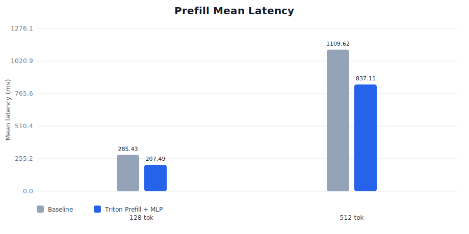
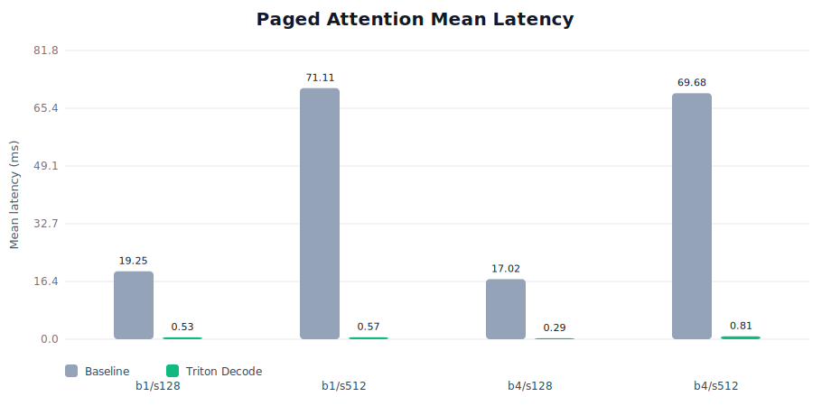
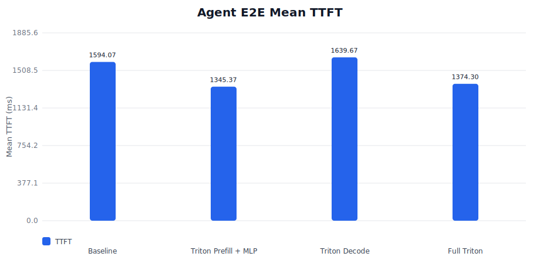
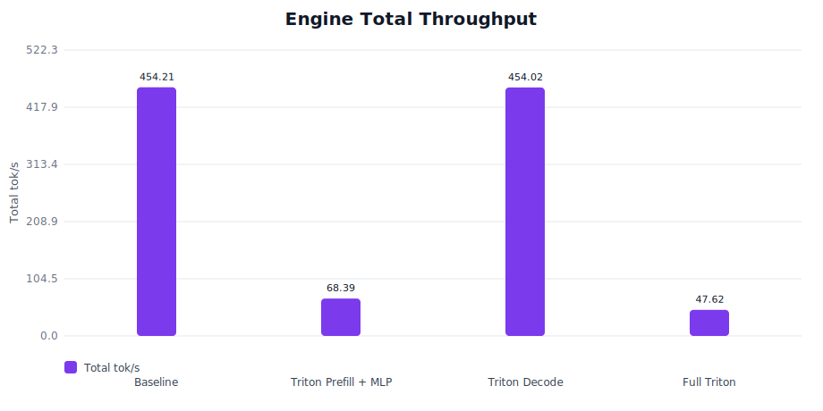

# somi-inference

Minimal LLM inference engine — from PyTorch to CUDA/Triton.

A learning-oriented project that implements core LLM inference components from scratch, following vLLM/SGLang design patterns.

## Features

- **Paged Attention** — online softmax, GQA support
- **Continuous Batching** — scheduler + batching engine
- **Text-in / Text-out API** — `LLM.generate()` over tokenizer + runner + scheduler
- **Qwen2.5 Model** — hand-written forward pass (RMSNorm, RoPE, MHA, SwiGLU MLP)
- **HF Weight Loading** — load pretrained weights from Hugging Face (0.5B / 1.5B)
- **End-to-end Greedy Decode** — validated against HF reference output

## Roadmap

- [x] **Phase 1**: PyTorch baseline — paged attention, Qwen2.5 model, e2e greedy decode
- [x] **Phase 2**: End-to-end inference pipeline — ModelRunner, Tokenizer, text-in/text-out API
- [ ] **Phase 3**: Triton/CUDA optimization — core decode/prefill/MLP Triton paths landed, benchmarked, and currently paused before serving work
- [ ] **Phase 4**: Serving — HTTP API, concurrent requests, streaming

## Installation

```bash
uv sync
uv sync --extra triton  # optional CUDA-only Triton backend
```

## Pre-commit

This repo uses `pre-commit` to run `uv run --no-sync ruff check`,
`uv run --no-sync ty check`, and the committed fast test suite
(`uv run --no-sync pytest -m "not slow"`) before every commit.

If dependencies or the lockfile changed, run `uv sync` before relying on the
`--no-sync` commands.

Enable it in a local clone with:

```bash
uv sync
uv run pre-commit install
```

## Testing

```bash
uv run pytest                      # default committed suite
uv run pytest -m integration       # integration tests (requires GPU)
uv run pytest -m "not slow"        # fast local / pre-commit suite
uv run pytest tests/entrypoints/test_llm_e2e.py -m slow  # LLM slow e2e tests
```

## Benchmarking

The `triton` backend is optional and CUDA-only. Install it with
`uv sync --extra triton` and run `--backend triton` benchmarks on a CUDA
machine.

```bash
uv run python -m benchmarks.bench_prefill --model-name Qwen/Qwen2.5-0.5B --prompt-lens 32 128 512
uv run python -m benchmarks.bench_decode --model-name Qwen/Qwen2.5-0.5B --batch-sizes 1 4 --context-lens 128 512
uv run python -m benchmarks.bench_paged_attention --batch-sizes 1 4 --seq-lens 512 2048
uv run python -m benchmarks.bench_paged_attention --backend torch_ref --batch-sizes 1 4 --seq-lens 128 512
uv run python -m benchmarks.bench_paged_attention --backend triton --batch-sizes 1 4 --seq-lens 128 512
uv run python -m benchmarks.bench_e2e --model-name Qwen/Qwen2.5-0.5B --device cuda --dtype float16 --attention-backend torch_ref --decode-attention-backend torch_ref --mlp-backend torch_ref --workload agent-session --preset mid
uv run python -m benchmarks.bench_e2e --model-name Qwen/Qwen2.5-0.5B --device cuda --dtype float16 --attention-backend triton --decode-attention-backend triton --mlp-backend triton --workload chat-serving --preset long
uv run python -m benchmarks.bench_engine --model-name Qwen/Qwen2.5-0.5B --workload agent-session --preset mid --arrival-pattern burst --max-concurrent 4
scripts/run_cuda_benchmarks.sh             # lighter local preset
MODE=server scripts/run_cuda_benchmarks.sh # fuller server preset
scripts/run_resume_benchmarks.sh           # focused resume / README comparison
```

See `benchmarks/README.md` for more examples and JSONL output support.

## Evaluation

The focused evaluation used in this README runs a smaller but more story-driven
matrix:

- isolated prefill latency (`bench_prefill.py`)
- isolated paged-attention decode latency (`bench_paged_attention.py`)
- deterministic agent-style e2e TTFT (`bench_e2e.py`)
- continuous-batching throughput on the same trace (`bench_engine.py`)

It compares four runtime variants:

- `Baseline`: `torch_ref` prefill, `torch_ref` decode, `torch_ref` MLP
- `Triton Prefill + MLP`: `triton` prefill, `torch_ref` decode, `triton` MLP
- `Triton Decode`: `torch_ref` prefill, `triton` decode, `torch_ref` MLP
- `Full Triton`: `triton` prefill, `triton` decode, `triton` MLP

Reproduce the README numbers with:

```bash
scripts/run_resume_benchmarks.sh
```

<!-- resume-benchmarks:start -->

_Generated by `scripts/run_resume_benchmarks.sh`._

**Setup**

- Run: `2026-04-20-173126`
- Model: `Qwen/Qwen2.5-0.5B`
- Device: `NVIDIA GeForce GTX 1650 Ti`
- Dtype: `float16`
- Software: `Python 3.12.11` / `torch 2.10.0+cu128` / `CUDA 12.8`
- Workload: deterministic `agent-session` / `mid` trace with `output_tokens=1`

**Key Takeaways**

- Triton prefill + MLP cuts 512-token prefill latency from 1109.62 ms to 837.11 ms (1.33x).
- Triton paged attention is fastest on batch 1 / seq 512, improving raw decode-kernel latency by 125.46x.
- Triton Prefill + MLP lowers agent-session mean TTFT from 1594.07 ms to 1345.37 ms.
- Engine throughput stays roughly flat with Triton Decode (454.21 tok/s → 454.02 tok/s).
- Triton-prefill engine variants bottom out at 10.5% of baseline throughput on the current scheduler path.

**Variant Map**

- `Baseline`: `torch_ref` prefill, `torch_ref` decode, `torch_ref` MLP
- `Triton Prefill + MLP`: `triton` prefill, `torch_ref` decode, `triton` MLP
- `Triton Decode`: `torch_ref` prefill, `triton` decode, `torch_ref` MLP
- `Full Triton`: `triton` prefill, `triton` decode, `triton` MLP

**Prefill Microbenchmark**


| Prompt Tokens | Baseline Mean | Triton Mean | Speedup |
| ------------- | ------------: | ----------: | ------: |
| 128           |     285.43 ms |   207.49 ms |   1.38x |
| 512           |    1109.62 ms |   837.11 ms |   1.33x |

**Paged Attention Microbenchmark**


| Batch | Seq Len | Baseline Mean | Triton Mean | Speedup |
| ----- | ------- | ------------: | ----------: | ------: |
| 1     | 128     |     19.250 ms |    0.532 ms |  36.16x |
| 1     | 512     |     71.110 ms |    0.567 ms | 125.46x |
| 4     | 128     |     17.024 ms |    0.289 ms |  58.90x |
| 4     | 512     |     69.680 ms |    0.806 ms |  86.48x |

**Agent E2E (`agent-session`, `mid`, `output_tokens=1`)**


| Variant              |  Mean TTFT | Mean Turn Latency | Session Time | Total Tok/s | Δ TTFT vs Baseline |
| -------------------- | ---------: | ----------------: | -----------: | ----------: | -----------------: |
| Baseline             | 1594.07 ms |        1591.99 ms |   9551.96 ms |      458.02 |              +0.0% |
| Triton Prefill + MLP | 1345.37 ms |        1353.77 ms |   8122.59 ms |      538.62 |             +15.6% |
| Triton Decode        | 1639.67 ms |        1627.12 ms |   9762.71 ms |      448.13 |              -2.9% |
| Full Triton          | 1374.30 ms |        1374.70 ms |   8248.22 ms |      530.42 |             +13.8% |

**Engine Throughput (`agent-session`, `mid`, `output_tokens=1`)**


| Variant              | Request/s | Total Tok/s | Run Duration | Δ Tok/s vs Baseline |
| -------------------- | --------: | ----------: | -----------: | ------------------: |
| Baseline             |     0.623 |      454.21 |       9.63 s |               +0.0% |
| Triton Prefill + MLP |     0.094 |       68.39 |      63.97 s |              -84.9% |
| Triton Decode        |     0.623 |      454.02 |       9.64 s |               -0.0% |
| Full Triton          |     0.065 |       47.62 |      91.87 s |              -89.5% |

<!-- resume-benchmarks:end -->

## Project Structure

```
somi_inference/
├── core/
│   ├── paged_attention.py     # Paged attention with online softmax, GQA
│   ├── continuous_batching.py # Scheduler + batching engine
│   ├── model_runner.py        # Adapter + sampler execution layer
│   └── sampler.py             # Greedy / temperature / top-k / top-p / repetition penalty
├── benchmarks/
│   ├── bench_prefill.py       # Prefill latency and tok/s
│   ├── bench_decode.py        # Decode latency and tok/s
│   ├── bench_paged_attention.py # Raw paged attention microbenchmark
│   └── bench_engine.py        # Continuous batching throughput benchmark
├── entrypoints/
│   └── llm.py                 # High-level text-in / text-out API
└── models/
    ├── base.py                # ModelAdapter protocol, ForwardContext
    ├── loader.py              # Model-family dispatch from HF config
    ├── qwen2.py               # RMSNorm, RotaryEmbedding, Attention, MLP, DecoderLayer, Model
    └── qwen2_adapter.py       # QwenAdapter (prefill/decode) + HF weight loading
├── tokenizer.py               # HF tokenizer wrapper
```
